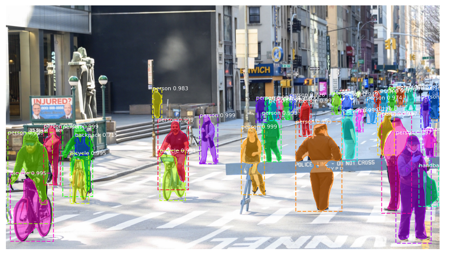

# instance-segmentation-mask-rcnn

Instance segmentation with Mask R-CNN

## overview

Image segmentation is the task of detecting and distinguishing multiple objects within a single image. There exist two mainstream segmentation paradigms; the **semantic segmentation** in which objects of the same class are assigned the same label, i.e. there is no distinguishing between individual object instances, and **instance segmentation** in which different instances of the same type of object in the input image, for example, car, are assigned distinct labels.

Mask R-CNN is an algorithm tailored for instance segmentation.

## repo contents

This repo contains 3 Google Colab notebooks:

- [mask_rcnn_pretrained_tpu.ipynb](https://raw.githubusercontent.com/georgiosouzounis/instance-segmentation-mask-rcnn/main/mask-rcnn-pretrained-tpu.ipynb); this is a demo using the COCO dataset classes, with the model pretrained on Google Cloud TPU;
- [mask_rcnn_pretrained_gpu.ipynb](https://raw.githubusercontent.com/georgiosouzounis/instance-segmentation-mask-rcnn/main/mask_rcnn_pretrained_gpu.ipynb); this is a demo using the same dataset, only imlemented in a custom manner using openCV;
- mask_rcnn_custom_gpu.ipynb; this is a Mask R-CNN custom training notebook for fine tuning the model to your data [to come]

## usage

You need a Google account and access to your Google Drive. Copy the contents of this repo and press shift-enter to enjoy the show.

## contact

[Contact the author](mailto:georgios.ouzounis@gmail.com)
